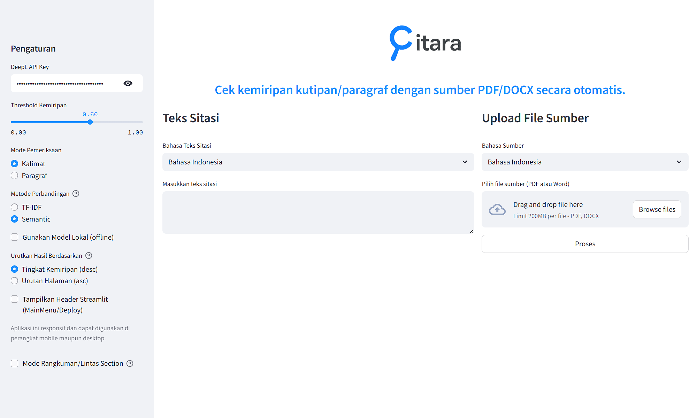

# Citara

**Citara** adalah aplikasi yang dirancang untuk membantu akademisi, peneliti, mahasiswa maupun orang-orang yang memiliki jiwa skeptis dalam memverifikasi keaslian dan kesamaan kutipan teks terhadap dokumen sumber. Aplikasi ini memanfaatkan model *machine learning* untuk analisis kemiripan teks yang mendalam, mendukung pemrosesan dokumen PDF dan Word, serta dilengkapi kemampuan terjemahan antar bahasa (Indonesia-Inggris) untuk fleksibilitas maksimal.

Dengan antarmuka pengguna yang intuitif berbasis web menggunakan Streamlit, Citara memudahkan proses validasi kutipan dan memastikan integritas akademik dalam pekerjaan Anda.

## Mengapa Citara?

Dalam dunia akademik dan penulisan ilmiah, akurasi sitasi adalah kunci. Aplikasi ini bertujuan untuk:
- **Memastikan Keaslian**: Verifikasi apakah sebuah kutipan benar-benar berasal dari bagian tertentu dalam dokumen sumber.
- **Mengukur Kemiripan**: Memberikan skor kuantitatif mengenai seberapa mirip teks kutipan dengan konten sumber, baik secara leksikal maupun semantik.
- **Mendukung Penelitian Multi-Bahasa**: Memfasilitasi pengecekan sumber yang mungkin berbeda bahasa dengan kutipan yang sedang dianalisis.
- **Mempermudah Alur Kerja**: Menyediakan alat bantu yang mudah digunakan untuk mempercepat proses pengecekan referensi.

## Fitur Utama

-   **Pemeriksaan Kutipan Komprehensif**:
    -   Analisis kemiripan antara teks kutipan (kalimat atau paragraf) dengan konten dokumen sumber (PDF atau DOCX).
    -   Dua mode perbandingan:
        -   **TF-IDF**: Metode statistik klasik untuk menilai pentingnya kata dalam dokumen, cocok untuk menemukan kecocokan kata kunci.
        -   **Semantik (Sentence-BERT)**: Menggunakan model *deep learning* untuk memahami makna dan konteks, ideal untuk mendeteksi kesamaan konseptual meskipun susunan kata berbeda (misalnya, parafrase).
    -   Pilihan untuk memeriksa berdasarkan **Kalimat** atau **Paragraf** untuk granularitas yang berbeda.
-   **Dukungan Multi-Bahasa (Indonesia & Inggris)**:
    -   Terjemahkan teks kutipan atau sumber secara otomatis antara Bahasa Indonesia dan Bahasa Inggris sebelum perbandingan.
    -   Opsi penggunaan **DeepL API** (memerlukan API Key) untuk terjemahan berkualitas tinggi atau **model terjemahan lokal** (MarianMT) untuk penggunaan offline atau tanpa API Key.
-   **Ekstraksi Teks dari Berbagai Format**:
    -   Ekstrak teks secara efisien dari file **PDF** (per halaman).
    -   Ekstrak teks dari file **Microsoft Word (.docx)**.
-   **Antarmuka Pengguna Interaktif**:
    -   Dibangun menggunakan **Streamlit** untuk kemudahan penggunaan dan visualisasi hasil.
    -   Pengaturan yang dapat disesuaikan: threshold kemiripan, mode pemeriksaan, metode perbandingan, dan pilihan terjemahan.
-   **Visualisasi Hasil**:
    -   Tampilkan segmen teks yang cocok dari dokumen sumber beserta skor kemiripannya.
    -   Urutkan hasil berdasarkan skor kemiripan atau nomor halaman.

## Fitur Baru: Mode Rangkuman/Lintas Section (Sliding Window)

-   **Mode Rangkuman/Lintas Section (Sliding Window)**:
    -   Fitur ini memungkinkan pemeriksaan kutipan yang merupakan gabungan atau rangkuman dari beberapa bagian berbeda dalam dokumen sumber.
    -   Dengan menggunakan teknik "sliding window", aplikasi akan mencari kecocokan kutipan terhadap kombinasi beberapa kalimat atau paragraf yang berurutan (window) di dokumen sumber.
    -   Anda dapat mengatur **ukuran window** (jumlah kalimat/paragraf yang digabung) dan memilih **unit window** (kalimat atau paragraf) melalui sidebar aplikasi.
    -   Sangat berguna untuk mendeteksi kutipan yang tidak diambil secara utuh dari satu bagian, melainkan merupakan rangkuman dari beberapa bagian berbeda dalam satu dokumen.
    -   Hasil pemeriksaan akan menampilkan segmen sumber yang merupakan gabungan beberapa unit, beserta skor kemiripannya.

-   **Peningkatan Robustness Parsing**:
    -   Mode pemeriksaan kalimat dan paragraf kini menggunakan hasil parsing yang mengikuti struktur asli dokumen (berbasis blok layout PDF/DOCX, deteksi line wrapping, indentasi, dan judul/subjudul), bukan sekadar pemisahan dengan regex sederhana.
    -   Hal ini meningkatkan akurasi deteksi kemiripan dan meminimalisir kesalahan segmentasi.

## Teknologi Utama

Aplikasi ini dibangun menggunakan teknologi dan pustaka Python berikut:
-   **Streamlit**: Untuk membangun antarmuka pengguna web interaktif.
-   **Sentence-Transformers (Sentence-BERT)**: Untuk embedding kalimat dan perhitungan kemiripan semantik.
-   **Scikit-learn**: Untuk metode TF-IDF dan perhitungan kemiripan kosinus.
-   **PyMuPDF (Fitz)** & **PyPDF2**: Untuk ekstraksi teks dan manipulasi file PDF.
-   **python-docx**: Untuk ekstraksi teks dari file Microsoft Word.
-   **NLTK**: Untuk tokenisasi kalimat.
-   **DeepL API Client** & **Transformers (MarianMT)**: Untuk fungsionalitas terjemahan.

## Persiapan

1.  **Prasyarat**:
    -   Pastikan Anda sudah memasang Python 3.8+ di sistem Anda.
    -   (Sangat Direkomendasikan) Buat dan aktifkan *virtual environment* untuk isolasi dependensi proyek:
        ```bash
        python -m venv venv
        # Untuk Linux/macOS
        source venv/bin/activate
        # Untuk Windows
        # venv\Scripts\activate
        ```

2.  **Instalasi Dependensi**:
    -   Klon repositori ini (jika belum).
    -   Instal semua paket yang dibutuhkan menggunakan file `requirements.txt`:
        ```bash
        pip install -r requirements.txt
        ```
    -   Pastikan Anda telah meninjau `requirements.txt` untuk versi pustaka yang spesifik jika mengalami masalah kompatibilitas.

3.  **Konfigurasi API Key (Opsional, untuk Terjemahan DeepL)**:
    -   Jika Anda ingin menggunakan layanan terjemahan DeepL, Anda memerlukan API Key.
    -   Anda dapat menyetel *environment variable* `DeepL_API_KEY` dengan kunci Anda.
    -   Alternatifnya, Anda dapat memasukkan API Key langsung melalui antarmuka pengguna aplikasi saat pertama kali dijalankan.

## Cara Menjalankan Aplikasi

1.  Buka terminal atau command prompt.
2.  Arahkan ke direktori utama proyek tempat file `main.py` berada.
3.  Pastikan *virtual environment* Anda (jika dibuat) sudah aktif.
4.  Jalankan aplikasi menggunakan Streamlit:
    ```bash
    streamlit run main.py
    ```
5.  Aplikasi akan otomatis terbuka di browser web default Anda. Jika tidak, buka browser dan arahkan ke alamat yang ditampilkan di terminal (biasanya `http://localhost:8501`).

## Contoh Alur Penggunaan

1.  **Unggah Dokumen Sumber**: Pilih dan unggah file PDF atau DOCX yang ingin Anda jadikan referensi.
2.  **Masukkan Teks Kutipan**: Ketik atau salin-tempel teks kutipan yang ingin Anda periksa.
3.  **Atur Bahasa**: Tentukan bahasa teks kutipan dan bahasa dokumen sumber. Jika berbeda, aplikasi akan menawarkan terjemahan.
4.  **Konfigurasi Pengaturan (di Sidebar)**:
    -   Sesuaikan **Threshold Kemiripan** (misalnya, 0.6 untuk kemiripan 60%).
    -   Pilih **Mode Pemeriksaan** ("Kalimat", "Paragraf", atau aktifkan **Mode Rangkuman/Lintas Section** untuk sliding window).
    -   Pilih **Metode Perbandingan** ("TF-IDF" atau "Semantic").
    -   Pilih apakah akan menggunakan **Model Terjemahan Lokal** atau DeepL API.
    -   (Opsional) Jika mengaktifkan **Mode Rangkuman/Lintas Section**, atur ukuran window gabungan dan jenis unit (Kalimat/Paragraf).
5.  **Mulai Pemeriksaan**: Klik tombol "Periksa Kutipan".
6.  **Lihat Hasil**: Aplikasi akan menampilkan daftar segmen teks dari dokumen sumber yang cocok dengan kutipan Anda, beserta skor kemiripan dan nomor halaman/bagian. Anda dapat mengurutkan hasil sesuai kebutuhan.

### Contoh Penggunaan Mode Rangkuman/Lintas Section (Sliding Window)

Mode ini sangat berguna jika kutipan yang ingin Anda periksa merupakan gabungan atau rangkuman dari beberapa bagian berbeda dalam dokumen sumber (misal: kutipan yang merangkum satu paragraf dan setengah paragraf berikutnya, atau beberapa kalimat dari dua bagian berbeda yang berurutan).

Langkah penggunaan:
-   Aktifkan **Mode Rangkuman/Lintas Section (Sliding Window)** di sidebar aplikasi.
-   Pilih **unit window** (Kalimat/Paragraf) sesuai kebutuhan.
-   Atur **ukuran window** (misal: 2, 3, dst.) untuk menentukan berapa banyak unit yang akan digabungkan dalam satu window pencarian.
-   Lakukan pemeriksaan seperti biasa. Hasil akan menampilkan segmen sumber berupa gabungan beberapa unit yang paling mirip dengan kutipan Anda, beserta skor kemiripannya.
-   Anda dapat menyesuaikan ukuran window untuk menemukan kecocokan terbaik sesuai karakter kutipan.

## Struktur Proyek
```
citara/
├── main.py                # Titik masuk utama aplikasi Streamlit
├── ui.py                  # Komponen dan logika antarmuka pengguna
├── handlers.py            # Handler utama untuk file dan proses
├── requirements.txt       # Daftar dependensi Python
├── utils/                 # Modul utilitas (parsing, similarity, dsb.)
│   ├── docx_utils.py
│   ├── pdf_utils.py
│   ├── semantic_utils.py
│   ├── similarity_utils.py
│   └── translation_utils.py
├── assets/                # Logo dan aset gambar aplikasi
├── sample_file/           # Contoh file untuk pengujian
├── UI.png                 # Contoh tampilan aplikasi
├── README.md
├── LICENSE.md
```

## Tampil Antarmuka Pengguna (UI)



## Kontribusi

Masukan, laporan bug, dan kontribusi dalam bentuk *pull request* sangat kami hargai! Jika Anda menemukan masalah atau memiliki ide untuk peningkatan, silakan buat *issue* atau *pull request* di repositori proyek ini.

## Potensi Pengembangan di Masa Depan

Proyek ini memiliki potensi untuk dikembangkan lebih lanjut dengan fitur-fitur seperti:
-   Integrasi dengan basis data akademik (CrossRef, PubMed, dll.) untuk validasi sumber otomatis.
-   Pemeriksaan akurasi sitasi yang dihasilkan oleh Model Bahasa Besar (LLM), termasuk deteksi "halusinasi" sumber.
-   Analisis konteks sitasi untuk memahami bagaimana sebuah sumber dikutip (mendukung, menentang, menyebutkan).
-   Fitur anotasi dokumen yang lebih canggih.

## Lisensi

Proyek ini dilisensikan di bawah [MIT License](LICENSE.md)